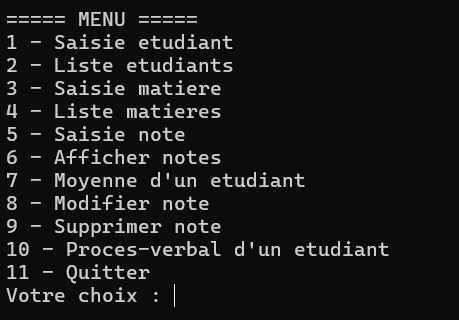

# Procès-Verbal (Gestion Étudiants, Matières, Notes) en C

Application console en C permettant de gérer :
- des **étudiants** (matricule, nom, date de naissance, sexe, filière)
- des **matières** (code, nom, crédit)
- des **notes** (matière, étudiant, séquence, note)
- l’édition d’un **procès-verbal** par étudiant (liste des notes + moyenne)

Le stockage se fait via des **fichiers binaires** `.ing`.

---

##  Fonctionnalités

### Étudiants
- Saisie d’un étudiant
- Liste des étudiants
- Validation de la date de naissance (format `JJ/MM/AAAA`)

### Matières
- Saisie d’une matière
- Liste des matières
- Vérification d’existence d’une matière par code

### Notes
- Saisie d’une note (avec contrôles)
- Affichage des notes
- Moyenne d’un étudiant
- Modifier une note (par matricule + matière + séquence)
- Supprimer une note
- Procès-verbal d’un étudiant (notes + moyenne)

---

##  Fichiers du projet

- `main.c` : menu principal
- `etudiant.c / etudiant.h` : gestion étudiants + validation date
- `matiere.c / matiere.h` : gestion matières
- `note.c / note.h` : gestion notes + PV

### Fichiers de données (créés automatiquement à l’exécution)
- `fetud.ing` : base étudiants (binaire)
- `fmatiere.ing` : base matières (binaire)
- `fnote.ing` : base notes (binaire)

---

##  Compilation (Windows/ Linux / macOS / WSL)

-Télécharger MinGW (avec GCC) puis vérifier : **gcc --version**

-Ensuite :Depuis le dossier du projet :

bash ou Powershell

-gcc -o proces_verbal main.c etudiant.c matiere.c note.c

-./proces_verbal
-proces_verbal.exe

